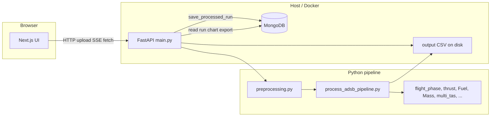

# TKAS Flight Analysis Tool — Project Details

This document describes the **flight-app** component of the **TKAS** workspace: a full-stack web application for analyzing ADS-B flight data from CSV uploads, computing fuel use and CO₂ estimates, and presenting routes, metrics, and charts.

---

## 1. Purpose

The application helps analysts and operators:

- Ingest **ADS-B-style CSV** tracks (e.g. raw FlightRadar24-style columns).
- Run a **Python processing pipeline** that cleans and resamples data, assigns **flight phases**, computes **thrust, mass, fuel, and CO₂**, and (when configured) uses **atmospheric/wind data** for **true airspeed (TAS)** and related physics.
- Persist each completed analysis as a **run** in **MongoDB**, with summary metrics, **segment breakdowns**, **map track**, **route/airport hints**, and **data-quality / phase-integrity** reporting.
- Serve a **Next.js** UI for upload, **Server-Sent Events (SSE)** progress, and a **results** dashboard with map (Leaflet), charts (Chart.js), tables, and CSV export.

Primary language mix: **Thai product copy** in the README; **English** in much of the backend strings and confidence explanations.

---

## 2. Repository context

| Path | Role |
|------|------|
| `flight-app/` | Main application (this document’s scope) |
| `flight-app/backend/` | FastAPI, pipeline scripts, MongoDB access |
| `flight-app/frontend/` | Next.js 14 App Router UI |
| `flight-app/docker-compose.yaml` | MongoDB, mongo-express, backend, frontend |

---

## 3. Technology stack

### 3.1 Frontend

| Area | Technology |
|------|------------|
| Framework | **Next.js 14.2** (App Router), **React 18**, **TypeScript** |
| Styling | **Tailwind CSS** |
| Maps | **Leaflet** + **react-leaflet** (dynamic import, `ssr: false`) |
| Charts | **Chart.js** + **react-chartjs-2** |
| CSV parsing (client) | **Papaparse** |
| Other | **jspdf** / **jspdf-autotable** (export paths as implemented), **axios** in dependencies |

### 3.2 Backend

| Area | Technology |
|------|------------|
| API | **FastAPI** served with **Uvicorn** (`main:app` is the default entry) |
| Database | **MongoDB** via **PyMongo** |
| Data / science | **pandas**, **numpy**, **scipy**, **xarray**, **netcdf4** / **h5netcdf** |
| Geodesy | **haversine** (package) and local helpers |

### 3.3 Infrastructure

- **Docker**: `python:3.11-slim` backend image; `node:18-alpine` frontend (build + `npm start`).
- **Compose services**: `mongodb` (port 27017), `mongo-express` (8081), `backend` (8000), `frontend` (3000).

---

## 4. High-level architecture

**Two FastAPI applications** exist in the repo:

1. **`backend/main.py`** — Primary app used by Docker Compose and local dev: `/upload`, background threading, real **SSE** progress, `/runs/*`, chart and export. This is the stack the **frontend** targets via `NEXT_PUBLIC_API_URL`.
2. **`backend/api/app.py`** — Alternate API: synchronous **`POST /calculate`** (subprocess to `process_adsb_pipeline.py`), plus overlapping `/runs` routes; SSE progress there is **simulated** (timed steps), not tied to actual pipeline stages. Useful for split deployments or experimentation; not the default Compose command.

---

## 5. End-to-end data flow (primary path: `main.py`)

1. User selects a **CSV** and **aircraft type** (UI maps labels such as “Boeing 737” → `737`, “Airbus 320” → `A320`).
2. **POST `/upload`** writes the file to a temp path, generates a **`run_id`**, updates progress, and starts **`_run_pipeline_background`** in a **daemon thread**.
3. Background work:
   - **`get_original_phases`** on the raw CSV (phase labels for later “original vs generated” comparison).
   - **`preprocessing`** → writes `*_preprocessed.csv` (resampling, cleaning, phase generation per config in `preprocessing.py` / `config.json` when present).
   - **`process(...)`** from **`process_adsb_pipeline.py`** reads the preprocessed CSV and writes **`output/output.csv`** (shared path under the backend tree).
   - Progress steps are updated (with deliberate sleeps for UX between some stages).
   - **`save_processed_run`** reads the output CSV, builds summaries and segments, and stores documents in MongoDB.
   - Temp files are removed where applicable.
4. Client opens **GET `/runs/{run_id}/progress`** (SSE) until completion or error (server-side loop timeout **300 seconds**).
5. Client navigates to **`/result?run_id=...`**, loads **GET `/runs/{run_id}`** and **GET `/runs/{run_id}/chart-data`**, renders map, charts, integrity card, export.

---

## 6. MongoDB model

### 6.1 Collections

| Collection | Purpose |
|------------|---------|
| **`flight_runs`** | One document per successful save: `run_id`, timestamps, aircraft type, summary metrics (`etow_kg`, fuel, CO₂, distance, duration), `segments`, `track_points`, `route_info`, `flight_date`, `data_quality`, `confidence*`, paths to files, etc. |
| **`flight_output_rows`** | Optional granular storage: per-row snapshots of the processed dataframe under `data` (batched inserts). |

Connection defaults (overridable via env) use URI auth against database **`flight_app`** with `authSource=admin` in examples.

### 6.2 Important behavior: single active run document on save

The function **`save_processed_run`** in `db/mongo.py` executes **`db.flight_runs.delete_many({})`** before inserting the new run. That means **each successful processing run replaces all previous run documents** in `flight_runs` for that database (while `run_id` remains stable for the current client session). Operators who need **history** should adjust this logic or use a separate database/backup strategy. (The **`insert_run_from_parsed`** path used by `api/app.py` does not perform this global delete in the same way—behavior differs by entrypoint.)

---

## 7. Backend modules (concise map)

| Module / area | Responsibility |
|---------------|----------------|
| **`main.py`** | FastAPI app, CORS, `/upload`, `/health`, `/runs`, chart-data, export, SSE progress store |
| **`preprocessing.py`** | Resampling, cleaning, UTC handling, aircraft-specific parameters from `config.json` |
| **`process_adsb_pipeline.py`** | Orchestrates CSV read, column normalization, `flight_phase`, `variable_mass`, `thrust`, `Fuel`, `Mass`, `multi_tas`, summary rows (ETOW, fuels, CO₂), output CSV |
| **`flight_phase.py`** | Phase detection (`detect_flight_phase`) |
| **`multi_tas.py`** | TAS and wind-related work using **xarray**; can use **Copernicus CDS** / **ERA5** and **NOAA GFS** depending on age of flight and configuration—requires valid CDS credentials in the environment where the pipeline runs |
| **`db/mongo.py`** | Connection helpers, **`save_processed_run`**, **`get_run`**, **`get_all_runs`**, **`delete_run`**, route building via **Overpass** / **Nominatim**, phase status vs **`EXPECTED_PHASES_LIST`** |
| **`api/parse_output_csv.py`** | Parses pipeline CSV into dataframe + summary for **`insert_run_from_parsed`** |
| **`api/app.py`** | Alternate **`/calculate`** and duplicated REST surface |

Supporting files include **`thrust.py`**, **`Fuel.py`**, **`Mass.py`**, **`variable_mass.py`**, **`Total_Energy.py`**, **`haversine.py`**, **`cleaning.py`**, legacy SQLite helpers under **`db/`** (referenced in comments).

---

## 8. Flight phases and data quality

**Expected phases** (nine), in order:

`Taxi_out`, `Takeoff`, `Initial_climb`, `Climb`, `Cruise`, `Descent`, `Approach`, `Landing`, `Taxi_in`

**`data_quality`** on each run includes counts, **`phase_status`** per phase (`original` | `generated` | `missing`), flags for resampling/cleaning/generation, and derived **`confidence`** (`high` / `medium`) plus a human-readable **`confidence_detail`** (row density, synthetic phases, reporting suitability).

---

## 9. HTTP API — `main.py` (authoritative for current UI)

| Method | Path | Description |
|--------|------|-------------|
| GET | `/` | Health message |
| GET | `/health` | Basic OK |
| GET | `/health/db` | Mongo ping / DB name |
| POST | `/upload` | Multipart CSV + optional `aircraft_type`; returns `run_id`, processes in background |
| GET | `/runs` | List runs (summary) |
| GET | `/runs/{run_id}` | Full run payload |
| DELETE | `/runs/{run_id}` | Delete run and related output rows |
| GET | `/runs/{run_id}/chart-data` | Series for charts (time labels, altitude FL, TAS/GS kt, weight, fuel/CO₂ flows and cumulative) |
| GET | `/runs/{run_id}/export` | Download processed CSV |
| GET | `/runs/{run_id}/progress` | **SSE** stream of `{ step, progress, message }` until done/error/timeout |

Interactive docs: **`/docs`** (Swagger).

---

## 10. Frontend structure

| Area | Contents |
|------|----------|
| **`app/page.tsx`** | Upload flow, validation of required CSV headers, aircraft selection, **`ProcessingView`** + SSE |
| **`app/result/page.tsx`** | Loads run + chart data; dynamic **`FlightMap`**, **`FlightChart`**; metrics, segments, **`DataIntegrityCheck`**, **`ExportSection`** |
| **`app/layout.tsx`** | Shell / navbar |
| **`components/`** | `UploadZone`, `ProcessingView`, `FlightRouteHeader`, `FlightMap`, `FlightChart`, `SegmentsTable`, `MetricCard`, `Navbar`, `Toast`, `SkeletonLoader`, etc. |
| **`lib/api.ts`** | `API_URL` from **`NEXT_PUBLIC_API_URL`**, typed **`RunResult`**, **`uploadFlight`**, **`getRun`**, **`getChartData`**, **`exportRun`** |
| **`lib/formatters.ts`** | Duration, numbers, tonnes formatting |

---

## 11. CSV input requirements

The UI requires header names (case-insensitive):

`Timestamp`, `UTC`, `Callsign`, `Position`, `Altitude`, `Speed`, `Direction`

`Position` is typically parsed as **`lat,lon`** in preprocessing and pipeline code.

---

## 12. Environment variables

### Backend (`backend/.env` or Compose `environment`)

| Variable | Meaning |
|----------|---------|
| `MONGO_URI` | MongoDB connection string |
| `MONGO_DB` | Database name (default `flight_app`) |

See **`backend/.env.example`**.

### Frontend (`frontend/.env.local`)

| Variable | Meaning |
|----------|---------|
| `NEXT_PUBLIC_API_URL` | Browser-facing API base URL (e.g. `http://localhost:8000`) |

See **`frontend/.env.local.example`**.

**Docker note:** Compose sets `NEXT_PUBLIC_API_URL=http://localhost:8000` so the **browser** on the host calls the published backend port. For production, set this to the public API URL clients can reach.

---

## 13. Running locally

- **Backend:** Python 3.11+, venv, `pip install -r requirements.txt`, `uvicorn main:app --reload --host 0.0.0.0 --port 8000` from `backend/`.
- **Frontend:** `npm install`, `npm run dev` from `frontend/` (port 3000).
- **MongoDB:** Local or Docker; credentials must match `MONGO_URI`.

**Compose:** From `flight-app/`, `docker compose up -d` starts all services; **`mongo-express`** is on **8081** with credentials aligned to the MongoDB service.

---

## 14. Operational and security notes

- **CORS** in FastAPI is currently **permissive** (`allow_origins=["*"]`) — restrict for production.
- **SSE** progress in **`main.py`** is cleared when the stream ends; long pipelines may hit the **300 s** SSE loop timeout—tune if needed.
- **Wind / ERA5** code paths depend on **network access** and **valid CDS API configuration**; failures surface as pipeline or TAS errors depending on code paths.
- **Secrets:** Do not commit API keys. If credentials appear in source files, rotate them and move to environment variables.

---

## 15. Related documentation

- **`README.md`** — Thai language user/operator guide (setup, CSV format, API table, troubleshooting).
- **Swagger** — `http://localhost:8000/docs` when the backend is running.

---

*Generated as a structural overview of the flight-app project. For line-level behavior, refer to the source files cited above.*
